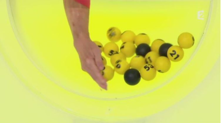
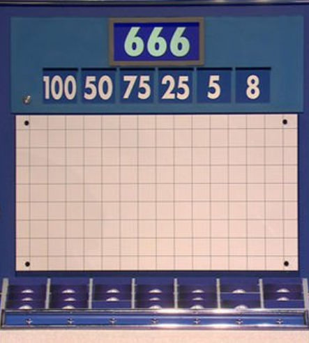
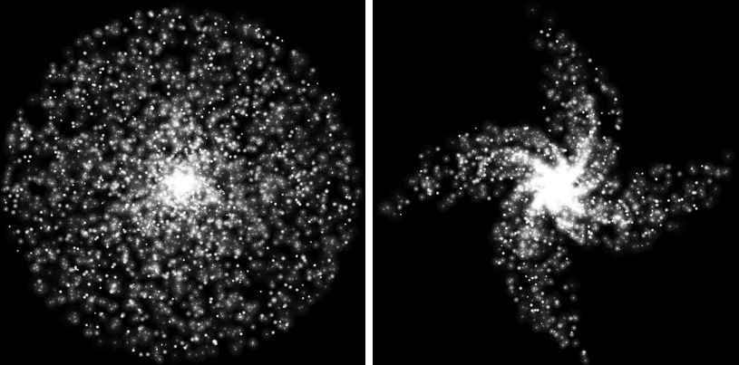

---
author:
- NERD
title: NERD C++ Algorithmic Exercises
---

Copyright 2023-2025 Nintendo European Research And Development. Ne pas
distribuer. Do not distribute.

# Foreword

First of all, a few important things:

- We are looking for two things: correctness and performance.

- There is no time limit to submit. Take the time you need to provide
  your best solution.

- Your solution will be reviewed by actual NERD engineers, not by an
  automated review/scoring/set of tests.

## Requirements

These exercises will require you to write C++ code, so here are a few
guidelines:

- Respect the provided skeleton API (we use them for testing). Don’t
  modify it without a convincing justification.

- Your code must be able to be called several times, sequentially, on
  different inputs. If you choose not to handle some cases with the
  input data, mention it.

- About coding style, do as you prefer. However, legibility and
  cleanliness will be taken into account.

- If you feel that using an external library (other than the standard
  library) can be useful, you can use it. But note that this will break
  our testing framework environment, so you will have to justify this
  usage and change the build system adequately.

## Recommendations

Consider including a brief development log that explains your reasoning
and decision-making process. It could cover why you chose your approach,
any alternatives you considered, what tests or benchmarks you performed,
and the results you observed. The goal is to understand not only the
code but also the thought process behind it.  
  
To support this, the package is also provided with an initial GIT commit
for you to version your changes as you progress through the exercises.
By structuring your commits, the review team would be able to better
appreciate your typical workflow.  
  
A CMake-based framework is provided, you’re free to use it or not. For
details regarding the build system, please read the file found at the
root of the exercises package.

## About AI usage

Nowadays, it’s common to use AI tools for assistance. However, please be
aware that your submission will be evaluated as a measure of your own
skills and understanding. Excessive reliance on AI can prevent us from
accurately assessing your capabilities.

## Have fun!

If you want clarifications of problem statements, or if you are not sure
of what we expect from you, please ask.  
  
We welcome any comments you have about the exercises.

# MoMoMotus

How would you pseudo-randomly sample $K$ distinct numbers in the range
$[0, N [$, keeping in mind those constraints:

- $K$ and $N$ are large, like $N$ up to $2^{64}$ (you are allowed to
  limit values to 64 bits)

- Algorithmic average time complexity should be $O(K)$ to produce $K$
  values (thus $O(1)$ per output value)

- The algorithm must use only a **fixed amount of memory**, independent
  of $K$ and $N$)

- Each output value must be unique (no duplicates)

- The output distribution must respect a reasonable level of randomness,
  meaning at the very least uniformly distributed. We provide an Operm5
  quick test to help you bootstrap your randomness analysis, but this
  test alone is far from sufficient.

<figure>

 
Mo Mo Motus !

</figure>

# T10. Worse than Dvorak

Remember the not so old time when we had to type SMS with a numerical
keypad?  
  
On such keypad, to enter a letter, one has to press multiple times on a
single key to loop through the letters and select the one they want. If
the following letter to enter is on the same key, they have to wait for
the previous letter to be validated before pressing again on the same
key. Entering a letter from another key doesn’t require this wait.  
  
For example: to enter “give me more”, one has to type:
`4_44488833063306_66677733`, where ’`_`’ is the wait needed to enter a
successive letter on the same key. Let’s say it costs the same as a key
press.  
  
Characters are mapped like this:

- A, B, C are mapped to 2

- D, E, F are mapped to 3

- G, H, I are mapped to 4

- J, K, L are mapped to 5

- M, N, O are mapped to 6

- P, Q, R, S are mapped to 7

- T, U, V are mapped to 8

- W, X, Y, Z are mapped to 9

How would you change that mapping, so as to minimize the cost of typing
text?  
  
Your mission is to devise an algorithm that, given a text corpus,
provides the best possible layout for retyping the whole corpus. Is this
layout optimal? Can you prove it ?  
  
You will find an example corpus in `source/T10/Data` folder.

<figure>

 
<code>4666_666306665553084446337777</code>

</figure>

# “Le compte est bon”. Finding the formula

Find an algorithm that, when given $n+1$ positive integers
$(x_1, x_2, ...,
  x_n)$, $R$, and the following operations $+,-,*,/$ (where $a/b$ is
only allowed if there is no remainder and $a-b$ is allowed only when
$a>=b$), finds a formula that uses any given $x_i$ at most one time, and
produces $R$.  
  
For example: Given $[2,7,25,9,3,6]$ and $236$, the algorithm should
provide an answer like the following: $(9*25)+7+6-2=236$. Note that
$[2,7,25,9,3,6]$ and $755$ does not have a solution.  
  
To spice up things from the classical TV game, $(x_1, ...,x_n)$ can be
any integer up to $255$, and $R$ can be any representable integer. Also,
$n$ can be greater than 6. Note, however, that it can be really hard to
reach or go beyond 10. How big a $n$ can you handle?  
  
Has $[13,19,29,43,47,53,61,79]$ and $10921141$ a solution?  
  
For the sake of simplicity, we can assume the +,-,\*,/ operations are
the ones available in C++ on 64-bit unsigned integers (don’t bother
handling overflows).

<figure>

 
<code>0x8OO10CDC</code>

</figure>

# Star System. H2G2. Geometrical algorithms

To make this simple, let’s say that the universe is 2D, static, without
relativity.  
Given $​n$ stars with refueling stations ($​n$ being large, let’s say
$10 000
  000$), and a spaceship that is able to travel a distance $​d$ without
refueling, can the spaceship join any 2 stars in the system by jumps
from star to star with no segment longer than $​d$?  
  
Find an algorithm in (strictly) **​less** ​than $O(n^2)$, that finds the
lowest $d$ that makes the star system fully explorable.

<figure>

 
<em>Disclaimer</em>: Non contractual images. The actual stars
distribution we test on may be different.

</figure>

# Concurrency

Imagine *N* [spherical threads in a
vacuum](https://en.wikipedia.org/wiki/Spherical_cow), that need to
communicate. As they can’t hear each other in the vacuum, they have to
send their messages through the shared memory. You need to write the
main loop for these *N* threads. Each thread has a “MessageHandler”
associated with it, which provides messages to be sent to specific other
threads. Each thread has to get the messages from the message handler,
pass them to the target thread in a threadsafe way, and the target
thread has to receive the message and pass it to its respective message
handler. Whenever a message is passed to a message handler, new messages
may become available in that message handler. If all threads have no
messages left to send, all threads need to return.

#### Example, *N*=2:

1.  Thread 0 calls `GetMessageToSend()` on its message handler and gets
    a message `M` addressed at thread 1.

2.  Thread 0 forwards message `M` to thread 1 in a threadsafe way.

3.  Thread 1 reads message `M` and calls `ReceivedMessage(M)` on its
    message handler.

4.  Thread 0 and thread 1 call `GetMessageToSend()`, but it returns no
    message.

5.  Since no thread has a message left to send, thread 0 and thread 1
    stop by returning from `HandleMessages`.

The goal is to do this **correctly** and as fast as possible. To help
you during development, a single test case is provided. This test case
is only an example, your code has to work in any test case. Please add a
short description of your thought process and the rationale behind your
solution as a text file in the submission.

#### Special rules for this exercise:

- Only standard c++, up to c++20 is allowed

- No external libraries

- No compiler extensions

- Correctness should not rely on a particular platform (e.g. by knowing
  that some operations would be atomic on the platform)

- You are allowed to spawn more threads if you wish, but those are not
  allowed to access any MessageHandlers

- The number of threads may be as low as 2 and as high as e.g. 1000,
  ideally the performance should be decent in all cases

<figure>

 
<em>Disclaimer</em>: Cows are not to scale.

</figure>
